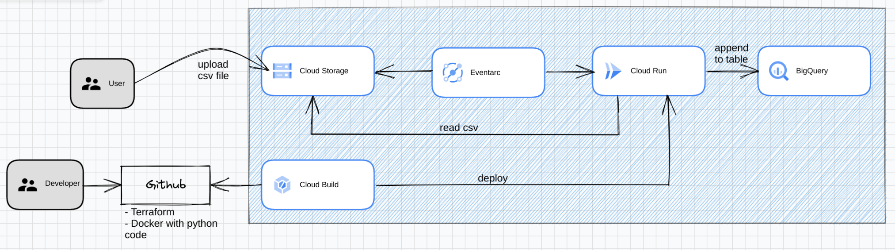

# CSV to BigQuery via GCS and CloudRun
Pipeline sample using GCS and CloudRun triggered by Eventarc to write a csv file into a BigQuery table

Source for enabling IAP with Cloud Run: [https://cloud.google.com/iap/docs/enabling-cloud-run](https://cloud.google.com/iap/docs/enabling-cloud-run)


## Overall architecture




## Project structure
```
.
|-- app (docker image for python load application logic)
|   |-- Dockerfile
|   |-- main.py
|   `-- requirements.txt
|-- README.md
|-- bigquery.tf (destination table and dataset)
|-- cloudbuild.tf (cloudbuild trigger for CI/CD)
|-- cloudbuild.yaml (build sequence for Cloud Build)
|-- cloudrun.tf (runtime for Docker container)
|-- config.tf (services and provider configuration)
|-- eventarc.tf (message pub/sub component between GCS and CloudRun)
|-- gcr.tf (managed artifact repository)
|-- gcs.tf (input bucket for csv files)
|-- iam.tf (service accounts and roles)
|-- install.sh (install script for gcp api using gcloud command)
|-- terraform.tfvars.json(local env variables for terraform)
`-- vars.tf (variables configuration)

```

## Setup

1. Find out your GCP project's id and number from the dashboard in the cloud console, and update the following variables in the `terraform.tfvars.json` file. Replace `YOUR_PROJECT_NMR`, `YOUR_PROJECT_ID` and `your_project_region` with the correct values. 


```shell
{
    "project_id": "YOUR_PROJECT_ID",
    "project_nmr": YOUR_PROJECT_NMR,
    "project_default_region": "YOUR_PROJECT_REGION"
}
```

## Install

1. Run the following command at the root of the folder:
```shell 
$ sudo ./install.sh
$ terraform init
$ terraform plan
$ terraform apply
```

> Note: You may have to run `terraform plan` and `terraform apply` twice if you get errors for serviceaccounts not found

2. Build and deploy the docker image in CloudRun service, by issuing the following command at the root of the project:

```shell
$ ./deploy.sh
```


3. To test, upload the sample file to the bucket

```shell
$ gsutil cp sample.csv gs://<YOUR_PROJECT_ID>-csv-input/
```
